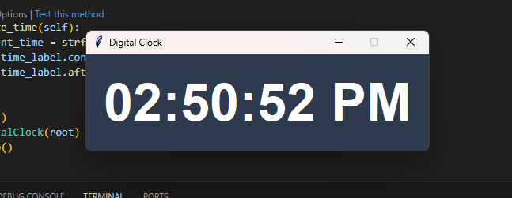

# Digital Clock

This project is a simple digital clock application built using Python and Tkinter. It displays the current time in a user-friendly interface.

# Screenshot


## Features

- **Real-Time Clock**: Continuously updates to show the current time in hours, minutes, and seconds.
- **User-Friendly Interface**: Displays time in a large, easy-to-read format.
- **Customizable Appearance**: Uses a modern color scheme for the background and text.

## Requirements

- Python 3.x
- `tkinter` library (usually included with Python)

## Installation

1. Clone the repository:
   ```bash
   git clone https://github.com/sifat-8208/PyDigitalClock.git
   ```
2. Navigate to the project directory:
   ```bash
   cd PyDigitalClock
   ```

## Usage

1. Run the clock script:
   ```bash
   python clock.py
   ```
2. The digital clock will display the current time and update every second.

## License

This project is licensed under the [MIT License](https://opensource.org/licenses/MIT). You are free to use, modify, and distribute this project.

## Disclaimer

This application is intended for educational and informational purposes. Enjoy using the Digital Clock and feel free to contribute or modify the code as you wish!